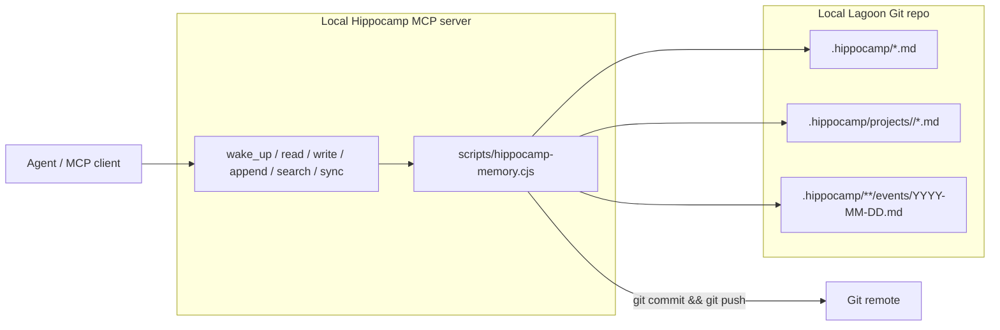

# Architecture

Hippocamp is a local MCP server backed by a Git clone.

## Diagram



## Core Ideas

- Durable memory is plain Markdown.
- The local Lagoon clone is the source of truth for reads and writes.
- Sync uses normal Git commands, not GitHub API tokens.
- Global memory and project memory share the same Lagoon repo.
- Project memory is namespaced by a slug inferred from the current project root.

## Roots

```text
HIPPOCAMP_GLOBAL_ROOT          default: ~/.lagoon
HIPPOCAMP_PROJECT_ROOT         default: current working directory
```

Global memory:

```text
${HIPPOCAMP_GLOBAL_ROOT}/.hippocamp/
```

Project memory:

```text
${HIPPOCAMP_GLOBAL_ROOT}/.hippocamp/projects/<project-slug>/
```

## Sync

`write_memory_file` and `append_event` sync by default:

1. Write the target Markdown file under the selected memory root.
2. Stage only paths inside the selected `.hippocamp/` root.
3. Commit with a Hippocamp message.
4. Push the current Lagoon branch.
5. If push fails, run `git pull --rebase --autostash` and retry once.

If the Lagoon repo has no upstream or git auth is not configured, the write can still happen locally but push will fail or be skipped. Users should fix normal Git auth rather than configure Hippocamp-specific tokens.

## Deferred

Cloud API, GitHub App auth, Dream PRs, branch-per-agent workflows, and automatic compaction are intentionally deferred. They should build on this local baseline instead of complicating the MVP.
