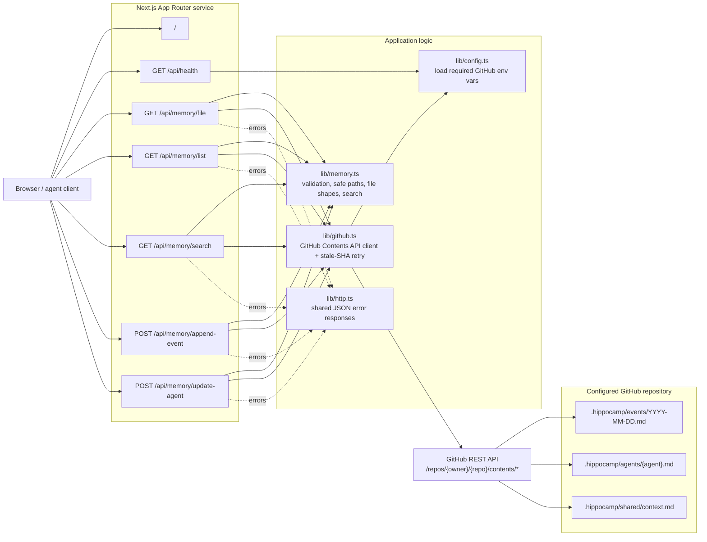
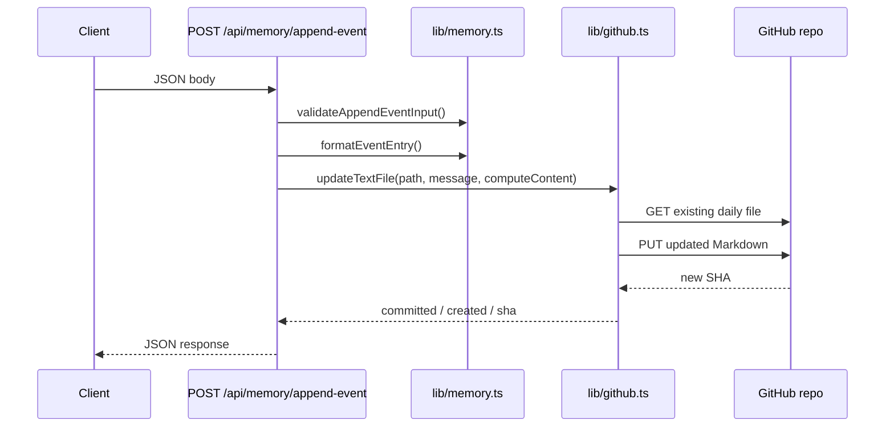

# Architecture

This project is a small Next.js service that treats a GitHub repository as the source of truth for shared agent memory.

## High-Level Diagram



## Request Flow: Append Event



## Core Ideas

- The app itself does not store memory locally.
- All durable state lives in one GitHub repository under `.hippocamp/`.
- `lib/memory.ts` enforces the memory model:
  - safe paths under `.hippocamp/`
  - valid agent names
  - event formatting
  - search helpers
- `lib/github.ts` is the only storage integration layer.

## Memory Layout

```text
.hippocamp/
  events/
    YYYY-MM-DD.md
  agents/
    {agent}.md
  shared/
    context.md
```

## Endpoint Responsibilities

- `GET /api/health`
  - returns service status
  - reports whether required GitHub env vars are present
- `GET /api/memory/file`
  - reads one Markdown file from GitHub
- `PUT /api/memory/file`
  - creates or overwrites one Markdown file under `.hippocamp/`
- `GET /api/memory/list`
  - lists files or folders under a safe `.hippocamp/` path
- `GET /api/memory/search`
  - recursively scans Markdown files and returns substring matches
- `POST /api/memory/append-event`
  - appends one formatted event block to the current UTC daily log
- `POST /api/memory/update-agent`
  - creates or overwrites one agent working-memory file

## Operational Constraints

- The service requires:
  - `GITHUB_TOKEN`
  - `GITHUB_OWNER`
  - `GITHUB_REPO`
  - `GITHUB_BRANCH`
- Without those env vars, the app can boot and `/api/health` works, but GitHub-backed memory endpoints fail at runtime.
- Writes go directly to the configured GitHub branch through the contents API.
- If a write hits a stale SHA, the GitHub layer retries once with the latest file state.
